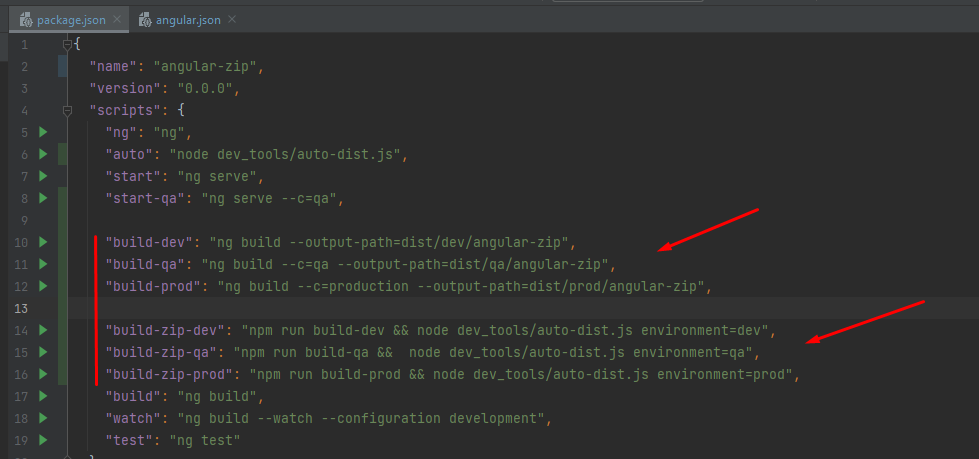
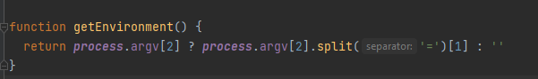

# Angular build zip environment

This project was generated with [Angular CLI](https://github.com/angular/angular-cli) version 14.2.12.

## Primero pasos intalar `zip-a-folder`

### Zip-a-folder [Documentación](https://www.npmjs.com/package/zip-a-folder)

comando a intalar: `npm i zip-a-folder`

Luego crear una carpeta llamada ***_dev_tools_***, donde también se crea el archivo ***auto-dist.js*** en la cual se implementara una lógica del zip.

Luego despues realizar las configuraciones en el `package.json`, nuevos comando a ejecutar.

en el primer grupo de comando agregas la configuración la ruta que se creara y en el segundo grupo llamamos al primer grupo y a la par ejecutamos el archivo ya creado y enviamos también el environment el cual llegara a la función `getEnvironment()`

### Ejemplos de comandoa a ejecutar:

- npm run build-zip-qa.
- npm run build-zip-prod.

